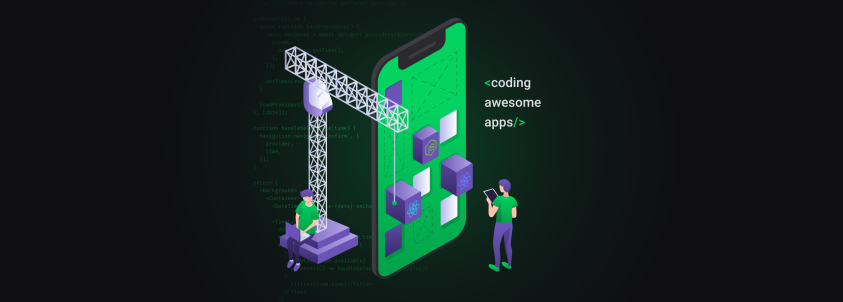

# Semana OmniStack 11 - Backend

### Criando o banco SQLite com as tabelas

- `npx knex migrate:latest`

### Rodando o projeto local

- `yarn install`

- `yarn dev`

### Buildando o projeto

- `yarn build`

### Rodando o projeto em produção

- `yarn install --production`

- `npx knex migrate:latest`

- `yarn start`

